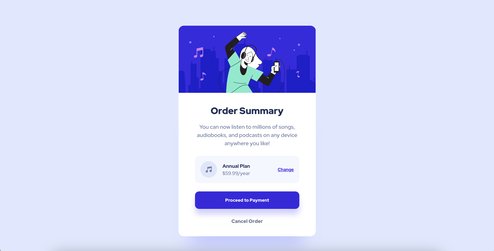

# Frontend Mentor - Order summary card solution

This is a solution to the [Order summary card challenge on Frontend Mentor](https://www.frontendmentor.io/challenges/order-summary-component-QlPmajDUj).

## Table of contents

- [Overview](#overview)
  - [The challenge](#the-challenge)
  - [Screenshot](#screenshot)
  - [Links](#links)
- [My process](#my-process)
  - [Built with](#built-with)
- [Author](#author)

## Overview

### The challenge

Users should be able to:

- See hover states for interactive elements

### Screenshots

### Links

- Solution URL: [Solution URL](https://www.frontendmentor.io/solutions/order-summary-component-using-flexbox-CAZdEbfXtQ)
- Live Site URL: [Live Site URL](https://dashaunn.github.io/FEM-order-summary-component-main/)

## My process

### Built with

- Semantic HTML5 markup
- CSS custom properties
- Flexbox
- Mobile-first workflow

## Author

- Github - [@dashaunn](https://github.com/dashaunn)
- Frontend Mentor - [Dashaun](https://www.frontendmentor.io/profile/dashaunn)